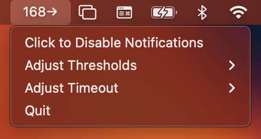
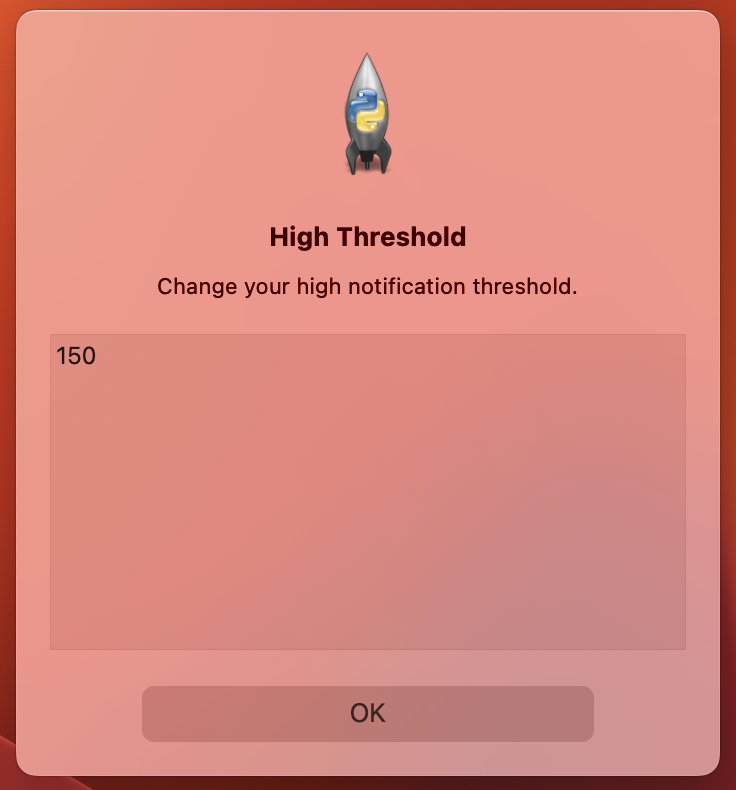

# DexMenuApp

macOS menu app that retrieves and displays Dexcom blood glucose data in the macOS menu bar, allowing users to access blood glucose data directly on their computer for convenience and discretion.


### Features

- Ability to enable or disable alerts
  
- Ability to adjust threshold values for alerts and alert timeouts
  

## Installation

First clone this repository, then create a .env file to hold your Dexcom username and password.

```env
username=<dexcom_username>
password=<dexcom_password>
```

## Usage

```python
python3 dexmenuapp.py
```

## Contributing

Pull requests are welcome. For major changes, please open an issue first to discuss what you would like to change.
